> **Note**: AI tools were used exclusively for documentation writing and structuring. All design, implementation, and verification were performed manually

## `top.sv` — Top-Level Core Integration

  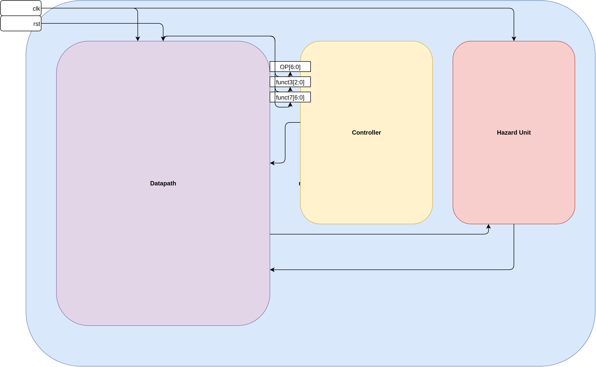

**Purpose**

* Acts as the **top-level wrapper** for the RV64I + Zba processor core
* Integrates datapath, controller, and hazard unit
* Exposes only **clock** and **reset** as external signals

**High-Level Role**

* Provides **structural connectivity**, not functionality
* Central wiring point for all pipeline control and hazard signals
* Entry point for simulation and synthesis

**Datapath Integration**

* Instantiates the **five-stage pipelined datapath**
* Handles:

  * Instruction fetch
  * Decode
  * Execute
  * Memory access
  * Writeback
* Receives control and hazard signals from other modules

**Controller Integration**

* Instantiates the **Controller** module
* Inputs:

  * `opcode`, `funct3`, `funct7` from instruction decode
* Outputs:

  * Register write enable
  * ALU source select
  * Memory write enable
  * Branch and jump controls
  * ALU operation encoding
* Fully responsible for **Zba instruction decode**

**Hazard Unit Integration**

* Instantiates the **Hazard Unit**
* Monitors:

  * Source and destination registers across pipeline stages
* Generates:

  * Stall signals (IF/ID)
  * Flush signals (ID/EX)
  * Forwarding paths (EX stage)
* Ensures correct execution under:

  * Data hazards
  * Load-use hazards
  * Control hazards

**Design Characteristics**

* Single global clock domain
* Synchronous reset behavior
* Instruction and data memories are internal to the datapath
* No peripherals, interrupts, or external buses
* Clean separation between:

  * Control logic
  * Datapath logic
  * Hazard handling

**Why This Structure**

* Simplifies debugging and verification
* Makes pipeline interactions explicit
* Allows independent modification of datapath, controller, or hazard unit
* Keeps the external interface minimal and stable

## `pc.sv` — Program Counter Logic (Instruction Fetch Stage)

  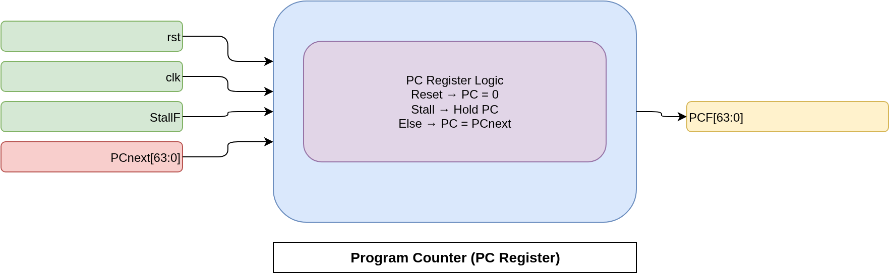

**Purpose**

* Implements the **Program Counter (PC)** register
* Maintains the address of the instruction currently being fetched
* Forms the foundation of the Instruction Fetch (IF) stage

**Module Role**

* Acts as a state-holding element for instruction sequencing
* Receives the next PC value from control-flow selection logic
* Provides the current PC value to instruction memory

**Inputs**

* `clk`

  * Global clock signal
  * PC updates occur on the rising edge
* `rst`

  * Synchronous reset
  * Forces PC to zero on assertion
* `StallF`

  * Fetch-stage stall signal from the hazard unit
  * Used to freeze PC during pipeline hazards
* `PCnext`

  * Next PC value selected by PC mux logic
  * Can represent sequential, branch, or jump targets

**Outputs**

* `PCF`

  * Current program counter value
  * Drives instruction memory addressing in the IF stage

**Core Behavior**

* On reset:

  * PC is initialized to `0`
* On stall:

  * PC value is held constant
  * Prevents instruction fetch from advancing
* On normal operation:

  * PC is updated with `PCnext` every cycle

**Design Characteristics**

* Fully synchronous design
* No combinational feedback paths
* Deterministic and hazard-aware PC control
* Simple logic to ease timing closure

**Pipeline Interaction**

* Controlled indirectly by:

  * Branch decisions
  * Jump logic
  * Hazard detection
* Enables correct instruction sequencing under stalls and flushes

## `PCPlus4_adder.sv` — Sequential PC Increment Logic

  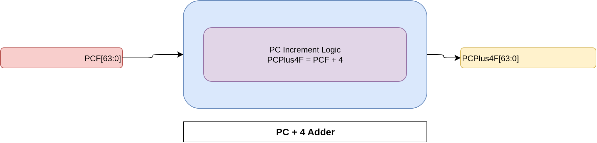

**Purpose**

* Computes the **sequential next program counter**
* Implements `PC + 4` logic for normal instruction flow
* Used when no branch or jump is taken

**Module Role**

* Purely combinational logic
* Part of the Instruction Fetch (IF) stage
* Feeds the PC selection mux with the sequential address

**Inputs**

* `PCF`

  * Current program counter value
  * Byte-addressed 64-bit address

**Outputs**

* `PCPlus4F`

  * Program counter incremented by 4 bytes
  * Represents the next sequential instruction address

**Core Functionality**

* Adds a constant value of `4` to `PCF`
* Assumes fixed-width 32-bit instructions
* No internal state or clock dependency

**Design Characteristics**

* Combinational adder only
* No control signals required
* Simple and timing-friendly logic
* Always active regardless of stalls or hazards

**Pipeline Interaction**

* Output is one of the inputs to the PC selection mux
* Used when:

  * No branch is taken
  * No jump instruction is executed
* Overridden by branch or jump targets when control flow changes

**Architectural Assumptions**

* Instruction size is always 4 bytes
* PC is byte-addressed
* Aligned instruction fetch is guaranteed

## `pc_mux.sv` — Program Counter Selection Multiplexer

  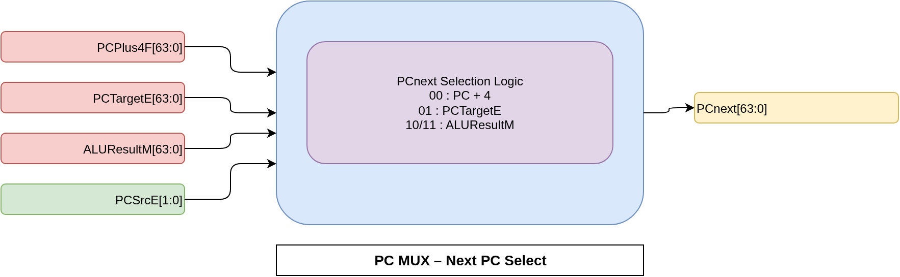

**Purpose**

* Selects the **next program counter value**
* Resolves control flow changes caused by branches and jumps
* Central decision point for instruction sequencing

**Module Role**

* Purely combinational selection logic
* Operates after control-flow resolution in the execute stage
* Feeds the selected PC value back to the PC register

**Inputs**

* `PCPlus4F`

  * Sequential PC value (`PC + 4`)
  * Used for normal instruction execution
* `PCTargetE`

  * Branch or direct jump target address
  * Computed in the execute stage
* `ALUResultM`

  * Indirect jump target (e.g., JALR)
  * Derived from ALU computation
* `PCSrcE`

  * Control signal selecting the PC source
  * Generated in the execute stage

**Outputs**

* `PCnext`

  * Final next PC value
  * Consumed by the PC register in the fetch stage

**PC Source Encoding**

* `PCSrcE = 2'b00`

  * Sequential execution (`PC + 4`)
* `PCSrcE = 2'b01`

  * Taken branch or direct jump (JAL)
* `PCSrcE = 2'b10`

  * Indirect jump (JALR)

**Core Functionality**

* Implements a 3-way multiplexer
* No internal state or clock dependency
* Deterministic selection based on resolved control flow

**Pipeline Interaction**

* Uses execute-stage results to redirect fetch
* Works in conjunction with:

  * Branch decision logic
  * Jump control logic
* Flush signals ensure incorrect-path instructions are discarded

**Design Characteristics**

* Simple combinational logic
* No hazard handling internally
* Relies on hazard unit for pipeline correctness

## `instmem.sv` — Instruction Memory (Fetch Stage)

  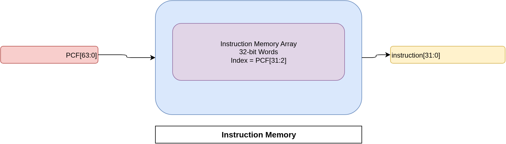

**Purpose**

* Implements the **instruction memory** used in the Instruction Fetch (IF) stage
* Supplies a 32-bit instruction based on the current program counter
* Models a simple read-only instruction storage

**Module Role**

* Acts as the source of instructions for the pipeline
* Provides combinational access with no modeled latency
* Intended for simulation and functional verification

**Inputs**

* `PCF`

  * Current program counter value
  * Byte-addressed 64-bit address

**Outputs**

* `instruction`

  * 32-bit fetched instruction
  * Forwarded to the decode stage

**Memory Organization**

* Internal array of 32-bit words
* Indexed using word-aligned addressing
* Lower two bits of `PCF` are discarded (`PCF[31:2]`)

**Initialization Behavior**

* Instruction memory is initialized at simulation start
* Uses `$readmemh` to load contents from `instruction.mem`
* Enables easy swapping of test programs without RTL changes

**Core Functionality**

* Combinational read access
* No clock dependency
* Always reflects the instruction at the current PC address

**Design Characteristics**

* Read-only memory model
* No write port or self-modifying code support
* No instruction cache or pipeline fetch latency modeled

**Architectural Assumptions**

* Instructions are fixed-width (32 bits)
* Program counter is byte-addressed
* Instruction addresses are word-aligned

**Pipeline Interaction**

* Feeds instructions directly into the IF/ID pipeline register
* Works in conjunction with PC update and selection logic
* Assumes hazards and control flow are resolved elsewhere

## `instruction_fetch.sv` — Instruction Field Decode

  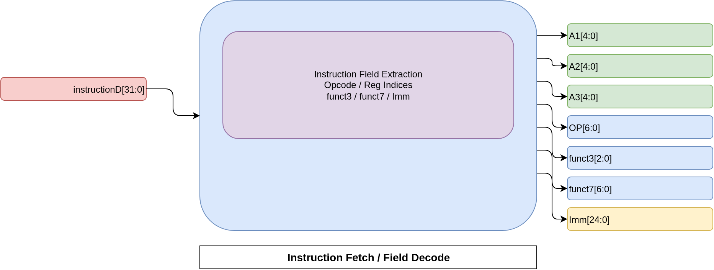

**Purpose**

* Extracts architectural fields from a 32-bit instruction word
* Separates register indices, opcode, function codes, and immediate bits
* Serves as the first step of the Instruction Decode (ID) stage

**Module Role**

* Purely combinational decode logic
* Acts as a structural decoder, not a control generator
* Supplies decoded fields to multiple downstream blocks

**Inputs**

* `instructionD`

  * 32-bit instruction word from IF/ID pipeline register
  * Assumed to be aligned and valid

**Outputs**

* `A1`

  * Source register 1 index (`rs1`)
* `A2`

  * Source register 2 index (`rs2`)
* `A3`

  * Destination register index (`rd`)
* `OP`

  * Opcode field
* `funct3`

  * Secondary function field
* `funct7`

  * Primary function field
* `Imm`

  * Raw immediate field (`instruction[31:7]`)

**Core Functionality**

* Performs bit slicing according to RISC-V encoding
* Decodes all fields in parallel
* No internal state or clock dependency

**Design Characteristics**

* Fully combinational logic
* No assumptions about instruction type
* Leaves interpretation of fields to:

  * Control unit
  * Immediate generator
  * Register file

**Architectural Assumptions**

* Instruction format follows RISC-V specification
* Fixed 32-bit instruction width
* Decode occurs in a single cycle

**Pipeline Interaction**

* Feeds:

  * Register file address ports
  * Controller opcode and function logic
  * Immediate sign-extension module
* Enables clean separation between decode and control logic

## `signext.sv` — Immediate Generation and Extension

  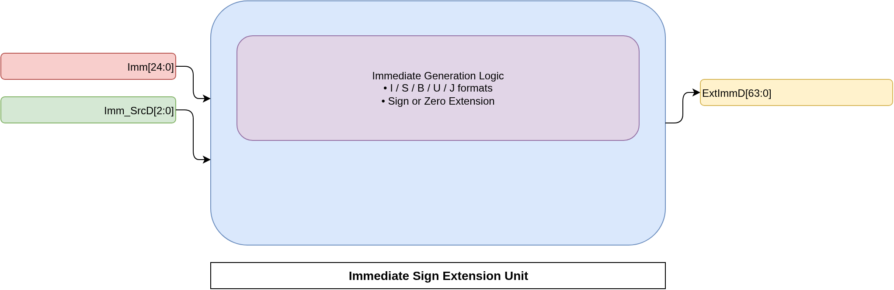

**Purpose**

* Generates **extended immediate values** from instruction-encoded fields
* Supports all immediate formats required by RV64I instructions
* Supplies properly formatted immediates to the execute stage

**Module Role**

* Acts as the immediate generation unit in the Instruction Decode (ID) stage
* Converts raw instruction bits into usable 64-bit values
* Is fully controlled by decode-stage control logic

**Inputs**

* `Imm_SrcD`

  * Immediate format selector from the controller
  * Determines how the immediate field is interpreted
* `Imm`

  * Raw immediate bits extracted from instruction `[31:7]`

**Outputs**

* `ExtImmD`

  * 64-bit sign-extended or zero-extended immediate value
  * Forwarded to the ID/EX pipeline register

**Supported Immediate Types**

* I-type (`Imm_SrcD = 3'b000`)

  * 12-bit signed immediate
  * Used by arithmetic and load instructions
* S-type (`Imm_SrcD = 3'b001`)

  * 12-bit signed immediate with split encoding
  * Used by store instructions
* B-type (`Imm_SrcD = 3'b010`)

  * 13-bit signed immediate
  * Least significant bit forced to zero
  * Used by branch instructions
* U-type (`Imm_SrcD = 3'b011`)

  * Upper immediate
  * Zero-extended and left-shifted
  * Used by LUI
* J-type (`Imm_SrcD = 3'b100`)

  * 21-bit signed immediate
  * Least significant bit forced to zero
  * Used by jump instructions

**Core Functionality**

* Performs sign-extension for signed immediates
* Performs zero-extension for upper immediates
* All logic is combinational
* No internal state or clock dependency

**Design Characteristics**

* Centralizes immediate decoding in a single module
* Keeps controller logic simple
* Ensures consistent immediate handling across the pipeline

**Pipeline Interaction**

* Immediate value is latched into the ID/EX pipeline register
* Used for:

  * ALU operand generation
  * Memory address calculation
  * Branch and jump target computation

## `regfile.sv` — Register File

  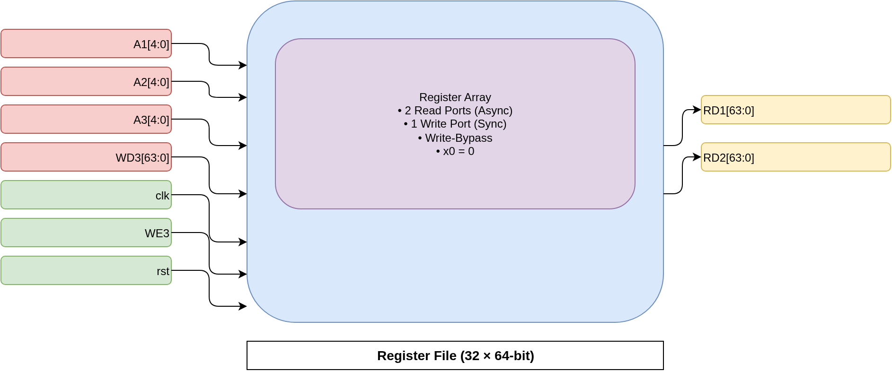

**Purpose**

* Implements the **architectural register file** for the processor
* Provides operand storage and retrieval for instruction execution
* Supports the RV64I requirement of 32 general-purpose registers

**Module Role**

* Serves the Instruction Decode (ID) and Writeback (WB) stages
* Supplies source operands to the execute stage
* Receives writeback results from the pipeline

**Register Organization**

* 32 registers (`x0`–`x31`)
* Each register is 64 bits wide
* Register `x0` is hardwired to zero

**Inputs**

* `A1`

  * Read address for source register 1 (`rs1`)
* `A2`

  * Read address for source register 2 (`rs2`)
* `A3`

  * Write address for destination register (`rd`)
* `WD3`

  * Writeback data
* `WE3`

  * Write enable signal from writeback stage
* `clk`

  * Global clock
* `rst`

  * Synchronous reset

**Outputs**

* `RD1`

  * Read data corresponding to `A1`
* `RD2`

  * Read data corresponding to `A2`

**Read Port Behavior**

* Reads are **combinational**
* Supports write-before-read bypass:

  * If a register is written and read in the same cycle, new data is forwarded
* Ensures `x0` always returns zero

**Write Port Behavior**

* Writes occur on the rising edge of the clock
* Write is ignored if destination register is `x0`
* On reset:

  * All registers are cleared to zero

**Design Characteristics**

* Two asynchronous read ports
* One synchronous write port
* No multi-cycle latency
* Deterministic and hazard-safe behavior

**Pipeline Interaction**

* Read operands are forwarded to the ID/EX pipeline register
* Writeback data is applied in the WB stage
* Bypass logic reduces unnecessary stalls

## `controller.sv` — Instruction Decode and Control Unit

  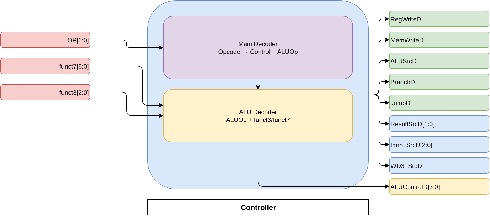

**Purpose**

* Implements the **central control logic** of the processor
* Decodes instruction fields to generate control signals for the datapath
* Coordinates ALU operations, memory access, branching, and writeback

**Module Role**

* Operates in the Instruction Decode (ID) stage
* Produces all decode-stage control signals
* Uses a two-level decode strategy for clarity and extensibility

**Inputs**

* `OP`

  * Opcode field identifying the instruction class
* `funct3`

  * Secondary function field for ALU and branch decoding
* `funct7`

  * Primary function field for ALU operation selection

**Outputs**

* `RegWriteD`

  * Enables register writeback
* `MemWriteD`

  * Enables data memory write
* `ALUSrcD`

  * Selects ALU operand source (register or immediate)
* `BranchD`

  * Indicates a conditional branch instruction
* `JumpD`

  * Indicates a jump instruction (JAL / JALR)
* `ResultSrcD`

  * Selects writeback data source
* `ALUControlD`

  * Encoded ALU operation
* `Imm_SrcD`

  * Immediate format selector
* `WD3_SrcD`

  * Writeback data source select for jump instructions

**Main Decoder**

* Decodes `OP` to determine instruction category
* Generates high-level control signals
* Assigns an intermediate `ALUOp` class
* Safely defaults to no-op for unsupported opcodes

**ALU Decoder**

* Uses `ALUOp`, `funct3`, and `funct7`
* Selects specific ALU operations
* Supports:

  * Standard RV64I arithmetic and logical operations
  * Load/store address calculation
  * Branch comparisons
  * Jump target computation

**Zba / Shifted-Add Support**

* Detects `funct7 = 0000100`
* Decodes shifted-add style operations:

  * `sh1add`
  * `sh2add`
  * `sh3add`
  * `add.uw`
* Encodes these operations into `ALUControlD`

**Design Characteristics**

* Fully combinational logic
* Clear separation between instruction classification and ALU selection
* Easily extensible to support additional instructions
* Ensures predictable behavior for illegal instructions

**Pipeline Interaction**

* Control signals are latched into the ID/EX pipeline register
* Drives behavior of execute, memory, and writeback stages
* Works with hazard unit to ensure correct control-flow handling

## `reglayer_one.sv` — IF/ID Pipeline Register

  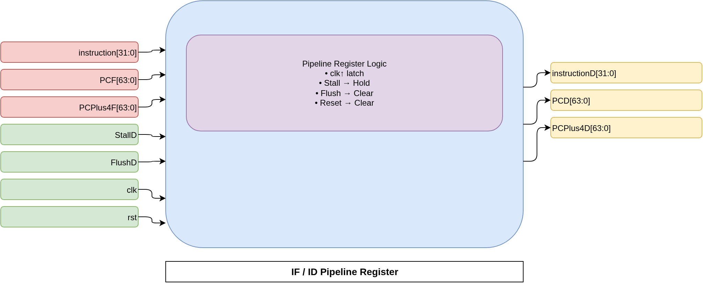

**Purpose**

* Implements the **pipeline register between IF and ID stages**
* Latches fetched instruction and PC-related values
* Enables controlled progression of instructions into decode

**Module Role**

* Serves as the boundary between Instruction Fetch and Instruction Decode
* Provides isolation between stages for hazard handling
* Supports both stalling and flushing of the decode stage

**Inputs**

* `clk`

  * Global clock
  * Pipeline state updates on rising edge
* `rst`

  * Synchronous reset
  * Clears all latched outputs
* `StallD`

  * Decode-stage stall signal from hazard unit
  * Freezes IF/ID state when asserted
* `FlushD`

  * Decode-stage flush signal
  * Inserts a bubble into the pipeline
* `instruction`

  * 32-bit instruction fetched in IF stage
* `PCF`

  * Program counter value from IF stage
* `PCPlus4F`

  * Sequential PC value (`PC + 4`) from IF stage

**Outputs**

* `instructionD`

  * Instruction forwarded to decode stage
* `PCD`

  * Program counter value for decode stage
* `PCPlus4D`

  * Sequential PC value for decode stage

**Core Behavior**

* On reset:

  * All outputs are cleared to zero
* On stall:

  * Current values are held
  * No new instruction enters decode
* On flush:

  * Outputs are cleared
  * Effectively injects a NOP
* On normal operation:

  * Instruction and PC values are latched from IF stage

**Priority Rules**

* Reset has highest priority
* Stall takes priority over flush
* Flush takes priority over normal latching

**Design Characteristics**

* Fully synchronous pipeline register
* No combinational feedback
* Deterministic control under hazards

**Pipeline Interaction**

* Prevents incorrect instruction decode during hazards
* Works with hazard unit to manage control-flow changes
* Ensures precise instruction delivery into ID stage

## `reglayer_two.sv` — ID/EX Pipeline Register

  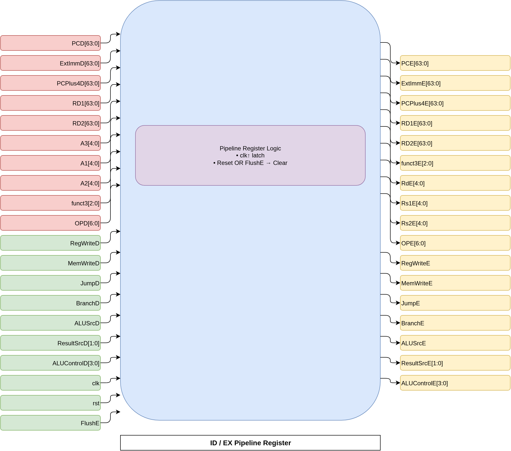

**Purpose**

* Implements the **pipeline register between Instruction Decode (ID) and Execute (EX) stages**
* Transfers decoded operands, immediates, and control signals into the execute stage
* Provides isolation between decode and execute for hazard handling

**Module Role**

* Acts as the synchronization boundary between ID and EX stages
* Holds all data and control required for ALU execution and control-flow resolution
* Supports execute-stage flushing for control hazards

**Inputs**

* Data signals:

  * `PCD` : Program counter from decode stage
  * `PCPlus4D` : Sequential PC value
  * `ExtImmD` : Sign-extended immediate
  * `RD1`, `RD2` : Register file read operands
* Register indices:

  * `A1`, `A2` : Source registers
  * `A3` : Destination register
* Instruction fields:

  * `funct3`
  * `OPD`
* Control signals:

  * `RegWriteD`
  * `MemWriteD`
  * `JumpD`
  * `BranchD`
  * `ALUSrcD`
  * `ResultSrcD`
  * `ALUControlD`
* Pipeline control:

  * `clk`
  * `rst`
  * `FlushE`

**Outputs**

* Data signals:

  * `PCE`
  * `PCPlus4E`
  * `ExtImmE`
  * `RD1E`, `RD2E`
* Register indices:

  * `Rs1E`, `Rs2E`
  * `RdE`
* Instruction fields:

  * `funct3E`
  * `OPE`
* Control signals:

  * `RegWriteE`
  * `MemWriteE`
  * `JumpE`
  * `BranchE`
  * `ALUSrcE`
  * `ResultSrcE`
  * `ALUControlE`

**Core Behavior**

* On reset or execute-stage flush:

  * All latched outputs are cleared
  * Effectively inserts a bubble into the execute stage
* On normal operation:

  * All decode-stage signals are latched into execute stage registers

**Priority Rules**

* Reset and `FlushE` have highest priority
* Flush invalidates execute-stage instruction to resolve control hazards

**Design Characteristics**

* Fully synchronous pipeline register
* Clear separation of decode and execute logic
* Ensures precise exception-free control flow

**Pipeline Interaction**

* Provides stable operands to:

  * ALU
  * Branch comparison logic
  * Forwarding and hazard units
* Enables correct execution of arithmetic, memory, and control-flow instructions

## `alu.sv` — Arithmetic Logic Unit (Execute Stage)

  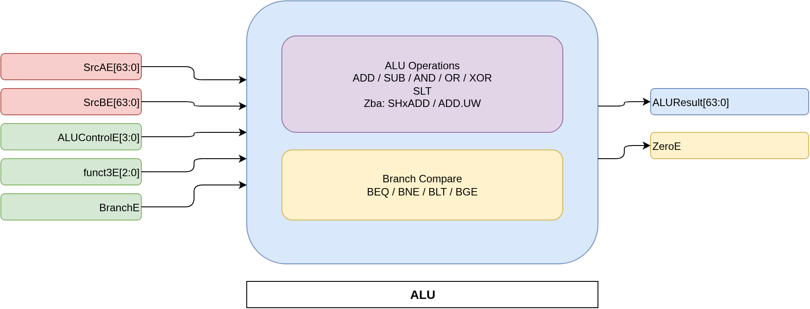

**Purpose**

* Implements the **Arithmetic Logic Unit (ALU)** for the execute stage
* Performs arithmetic, logical, comparison, and address-generation operations
* Evaluates branch conditions independently of result computation

**Module Role**

* Central compute block in the EX stage
* Produces computation results and branch decision flags
* Supports both standard RV64I operations and Zba extensions

**Inputs**

* `SrcAE`

  * First ALU operand
* `SrcBE`

  * Second ALU operand
* `ALUControlE`

  * Encoded ALU operation selector
* `funct3E`

  * Function field for branch condition decoding
* `BranchE`

  * Enables branch comparison logic

**Outputs**

* `ALUResult`

  * 64-bit computation result
* `ZeroE`

  * Branch condition flag
  * Asserted when the branch condition is satisfied

**Branch Comparison Logic**

* Active only when `BranchE` is asserted
* Uses `funct3E` to select comparison type:

  * `BEQ`  : equality check
  * `BNE`  : inequality check
  * `BLT`  : signed less-than
  * `BGE`  : signed greater-than-or-equal
* Forces `ZeroE` low when not evaluating a branch

**Supported ALU Operations**

* Standard RV64I:

  * ADD, SUB
  * AND, OR, XOR
  * SLT (signed comparison)
* Zba address-generation extensions:

  * `SH1ADD` : `A + (B << 1)`
  * `SH2ADD` : `A + (B << 2)`
  * `SH3ADD` : `A + (B << 3)`
  * `ADD.UW` : `A + zero_extend(B[31:0])`

**Core Functionality**

* Fully combinational design
* Result and branch flag computed in parallel
* Default behavior falls back to addition for safety

**Design Characteristics**

* 64-bit datapath
* Signed comparisons use two’s complement semantics
* No internal state or clock dependency
* Clean separation between result computation and branch evaluation

**Pipeline Interaction**

* `ALUResult` feeds:

  * Data memory address generation
  * Writeback result selection
  * Jump target computation
* `ZeroE` feeds:

  * Control-flow decision logic
  * PC selection and pipeline flushing

## `mux_SrcAE.sv` — ALU Source A Forwarding Multiplexer

  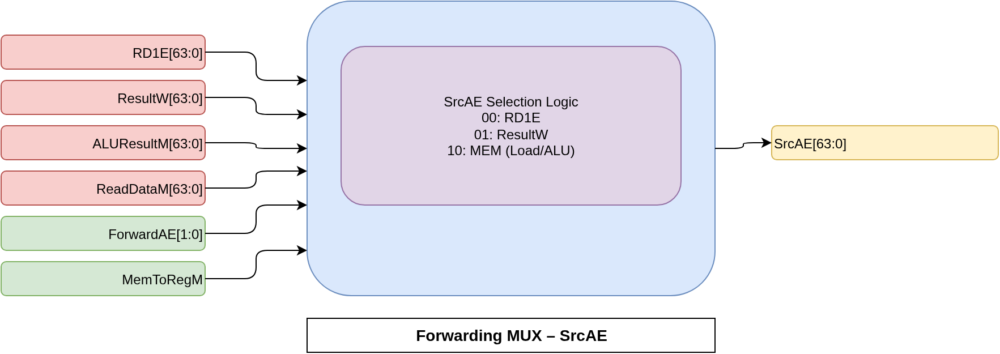

**Purpose**

* Selects the correct **ALU source A operand** in the execute stage
* Resolves data hazards using forwarding (bypassing) paths
* Ensures the ALU operates on the most recent data

**Module Role**

* Part of the execute-stage operand selection logic
* Works in conjunction with the hazard unit
* Prevents pipeline stalls caused by read-after-write hazards

**Inputs**

* `RD1E`

  * Operand read from register file (ID/EX stage)
* `ResultW`

  * Writeback stage result
* `ALUResultM`

  * ALU result from memory stage
* `ReadDataM`

  * Load data returned from data memory
* `ForwardAE`

  * Forwarding control signal from hazard unit
* `MemToRegM`

  * Indicates whether the MEM-stage instruction is a load

**Output**

* `SrcAE`

  * Selected operand A for the ALU

**Forwarding Selection Encoding**

* `ForwardAE = 2'b00`

  * Use register file value (`RD1E`)
* `ForwardAE = 2'b01`

  * Forward result from writeback stage (`ResultW`)
* `ForwardAE = 2'b10`

  * Forward from memory stage:

    * Load instruction: use `ReadDataM`
    * ALU instruction: use `ALUResultM`

**Core Functionality**

* Purely combinational logic
* Prioritizes forwarding over stale register values
* Supports load-use forwarding for branch and ALU operations

**Design Characteristics**

* No internal state
* Hazard-aware operand selection
* Enables single-cycle forwarding without pipeline stalls

**Pipeline Interaction**

* Receives forwarding decisions from hazard unit
* Supplies resolved operand to the ALU
* Critical for maintaining pipeline throughput and correctness

## `mux_SrcBE2.sv` — ALU Source B Immediate Select Multiplexer

  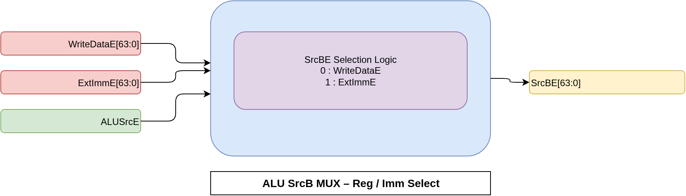

**Purpose**

* Selects the **second ALU operand** in the execute stage
* Enables switching between register-based and immediate-based operations
* Supports both register-register and register-immediate instructions

**Module Role**

* Final selection stage for ALU operand B
* Works after forwarding logic has resolved register hazards
* Controlled directly by decode-stage ALU source control

**Inputs**

* `WriteDataE`

  * Register-based operand after forwarding resolution
* `ExtImmE`

  * Sign-extended immediate value from ID/EX pipeline register
* `ALUSrcE`

  * ALU source select control signal

**Output**

* `SrcBE`

  * Selected operand B for the ALU

**Selection Behavior**

* `ALUSrcE = 0`

  * Use register-based operand (`WriteDataE`)
* `ALUSrcE = 1`

  * Use immediate operand (`ExtImmE`)

**Core Functionality**

* Simple 2-to-1 combinational multiplexer
* No internal state or clock dependency
* Immediate selection occurs after hazard resolution

**Design Characteristics**

* Clean separation between forwarding and immediate selection
* Minimal logic depth
* Deterministic operand selection

**Pipeline Interaction**

* Receives forwarded register data from prior mux stage
* Supplies resolved operand to the ALU
* Essential for executing:

  * ADDI and other I-type ALU instructions
  * Load/store address calculations
  * Jump target computations

## `mux_SrcBE1.sv` — ALU Source B Forwarding Multiplexer (Register Path)

  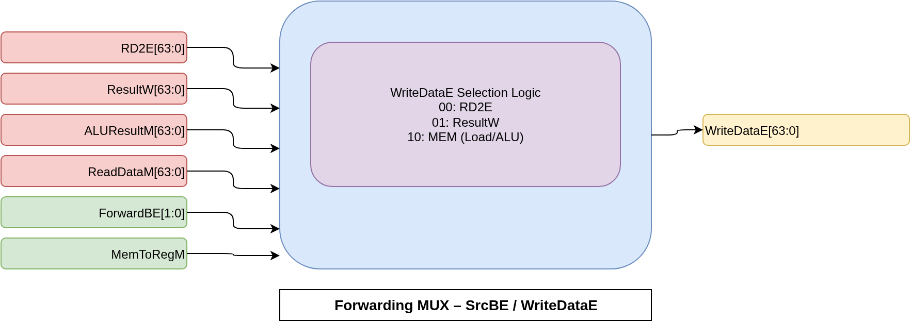

**Purpose**

* Selects the correct **register-based value** for ALU source B
* Resolves data hazards for the second operand
* Provides correct store write data and ALU input

**Module Role**

* First-stage selection for ALU source B
* Handles forwarding before immediate selection
* Feeds both:

  * ALU operand B path
  * Store data path

**Inputs**

* `RD2E`

  * Register file read data for source register 2
* `ResultW`

  * Writeback stage result
* `ALUResultM`

  * ALU result from memory stage
* `ReadDataM`

  * Load data from data memory
* `ForwardBE`

  * Forwarding control signal from hazard unit
* `MemToRegM`

  * Indicates MEM-stage instruction is a load

**Output**

* `WriteDataE`

  * Selected value for:

    * ALU source B (prior to immediate selection)
    * Store write data

**Forwarding Selection Encoding**

* `ForwardBE = 2'b00`

  * Use register file value (`RD2E`)
* `ForwardBE = 2'b01`

  * Forward from writeback stage (`ResultW`)
* `ForwardBE = 2'b10`

  * Forward from memory stage:

    * Load instruction: use `ReadDataM`
    * ALU instruction: use `ALUResultM`

**Core Functionality**

* Purely combinational forwarding logic
* Ensures most recent data is always selected
* Prevents unnecessary pipeline stalls

**Design Characteristics**

* No internal state
* Load-use hazard mitigation via forwarding
* Clean separation from immediate selection logic

**Pipeline Interaction**

* Works with hazard unit to resolve RAW hazards
* Supplies correct data to:

  * ALU operand selection logic
  * Data memory write path
* Essential for correct execution of dependent arithmetic and store instructions

## `hazard_unit.sv` — Hazard Detection and Forwarding Unit

  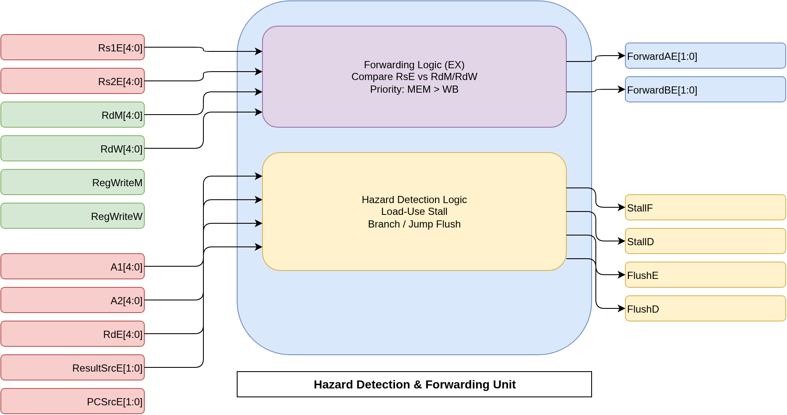

**Purpose**

* Detects and resolves **pipeline hazards**
* Ensures correct execution in a five-stage pipelined processor
* Handles data hazards, load-use hazards, and control hazards

**Module Role**

* Central coordination unit for pipeline control
* Observes register usage across ID, EX, MEM, and WB stages
* Generates forwarding, stall, and flush signals

**Inputs**

* Execute-stage registers:

  * `Rs1E`, `Rs2E` : Source registers
  * `RdE` : Destination register
  * `ResultSrcE` : Indicates load instruction
* Memory-stage registers:

  * `RdM`
  * `RegWriteM`
* Writeback-stage registers:

  * `RdW`
  * `RegWriteW`
* Decode-stage registers:

  * `A1`, `A2`
* Control-flow:

  * `PCSrcE` : Branch or jump taken indicator
* `clk`

  * Not used in logic
  * Reserved for future extensibility

**Outputs**

* `ForwardAE`

  * Forwarding control for ALU source A
* `ForwardBE`

  * Forwarding control for ALU source B
* `StallF`

  * Stalls instruction fetch stage
* `StallD`

  * Stalls instruction decode stage
* `FlushE`

  * Flushes execute stage
* `FlushD`

  * Flushes decode stage

**Data Forwarding Logic**

* Resolves read-after-write hazards without stalling
* Priority order:

  * Forward from MEM stage if destination matches EX source
  * Forward from WB stage if MEM forwarding not applicable
  * Otherwise use register file value
* Register `x0` is excluded from forwarding

**Load-Use Hazard Detection**

* Detects when:

  * EX-stage instruction is a load
  * ID-stage instruction depends on the load result
* Action taken:

  * Stall IF and ID stages
  * Flush EX stage to insert a bubble

**Control Hazard Handling**

* Branch and jump decisions resolved in EX stage
* When a branch or jump is taken:

  * Flush decode stage
  * Flush execute stage
* Prevents incorrect-path instructions from updating state

**Design Characteristics**

* Fully combinational logic
* No internal state
* Deterministic and predictable behavior
* Matches classic 5-stage RISC pipeline hazard handling

**Pipeline Interaction**

* Works tightly with:

  * Forwarding multiplexers
  * Pipeline registers
  * PC selection logic
* Enables high pipeline throughput with minimal stalls

## `PCTarget_adder.sv` — Branch and Jump Target Address Generator

  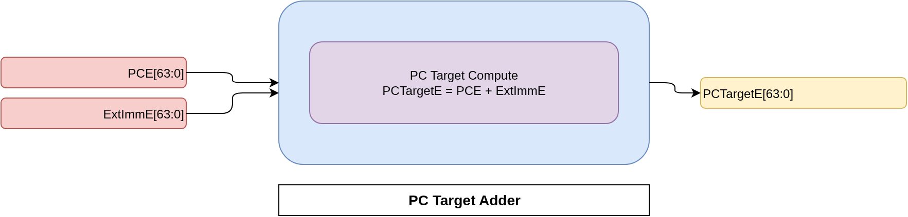

**Purpose**

* Computes the **target program counter** for control-flow instructions
* Used by branches and direct jumps
* Enables redirection of instruction fetch on control-flow changes

**Module Role**

* Part of the execute-stage control-flow logic
* Calculates the destination address before PC selection
* Works alongside branch decision and jump control logic

**Inputs**

* `PCE`

  * Program counter value in the execute stage
* `ExtImmE`

  * Sign-extended immediate offset
  * Encoded according to instruction format

**Output**

* `PCTargetE`

  * Computed target program counter value
  * Forwarded to the PC selection multiplexer

**Core Functionality**

* Adds immediate offset to the execute-stage PC
* Fully combinational logic
* No internal state or clock dependency

**Supported Use Cases**

* Conditional branch target computation
* Direct jump (JAL) target computation
* Offset-based control-flow redirection

**Design Characteristics**

* 64-bit adder
* Immediate offset assumed to be correctly sign-extended
* Simple and timing-efficient logic

**Pipeline Interaction**

* Used only when:

  * A branch is taken
  * A jump instruction is executed
* Output selected by `pc_mux` based on `PCSrcE`
* Ensures correct next-PC calculation before pipeline flush

## `reglayer_three.sv` — EX/MEM Pipeline Register

  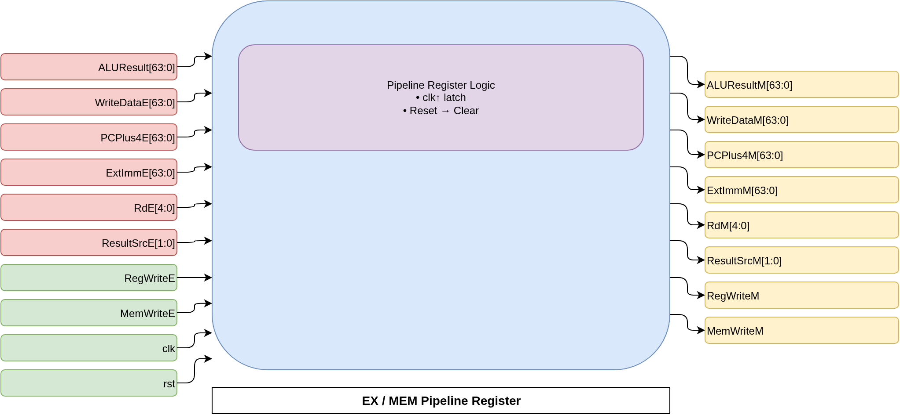

**Purpose**

* Implements the **pipeline register between Execute (EX) and Memory (MEM) stages**
* Transfers execution results and control signals into the memory stage
* Prepares data for memory access and writeback selection

**Module Role**

* Acts as the boundary between computation and memory access
* Preserves ALU results, store data, and control signals
* Ensures correct sequencing of memory and writeback operations

**Inputs**

* Data signals:

  * `ALUResult` : Result of ALU computation
  * `WriteDataE` : Store data from execute stage
  * `PCPlus4E` : Sequential PC value
  * `ExtImmE` : Immediate value
* Register indices:

  * `RdE` : Destination register
* Control signals:

  * `RegWriteE` : Register write enable
  * `MemWriteE` : Memory write enable
  * `ResultSrcE` : Writeback source selector
* Pipeline control:

  * `clk`
  * `rst`

**Outputs**

* Data signals:

  * `ALUResultM`
  * `WriteDataM`
  * `PCPlus4M`
  * `ExtImmM`
* Register indices:

  * `RdM`
* Control signals:

  * `RegWriteM`
  * `MemWriteM`
  * `ResultSrcM`

**Core Behavior**

* On reset:

  * All outputs cleared to safe defaults
* On normal operation:

  * Latches all execute-stage outputs on rising clock edge

**Design Characteristics**

* Fully synchronous pipeline register
* No stall or flush logic at this stage
* Clean separation between execute and memory stages

**Pipeline Interaction**

* Supplies:

  * Address and data for data memory access
  * Result selection information for writeback
* Works with data memory and MEM/WB pipeline register
* Ensures correct alignment of control and data signals

## `datamem.sv` — Data Memory (Load / Store Unit)

  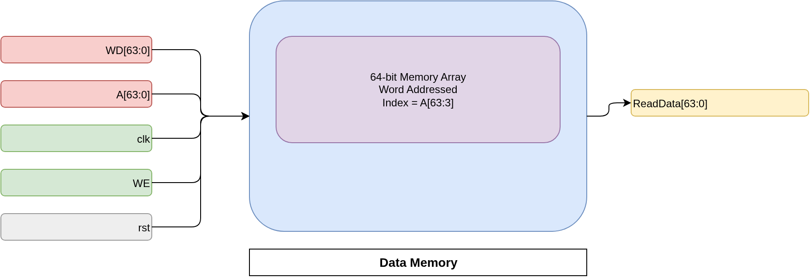

**Purpose**

* Implements the **data memory** used for load and store instructions
* Provides storage for program data during execution
* Models a simple single-cycle memory system

**Module Role**

* Serves the Memory (MEM) stage of the pipeline
* Supplies load data to the writeback stage
* Accepts store data from the execute stage

**Memory Organization**

* 64-bit wide word-addressable memory
* Internal array size: 1000 entries
* Addressed using word indices derived from byte addresses

**Inputs**

* `WD`

  * Write data for store instructions
* `A`

  * Byte-based memory address
* `WE`

  * Write enable signal
* `clk`

  * Global clock
* `rst`

  * Present but unused (memory not cleared on reset)

**Output**

* `ReadData`

  * Data read from memory for load instructions

**Read Behavior**

* Fully combinational read
* Address is converted from byte address to word index (`A >> 3`)
* Models single-cycle load latency

**Write Behavior**

* Synchronous write on rising clock edge
* Write occurs only when `WE` is asserted
* Address is word-aligned

**Initialization**

* Memory contents loaded at simulation start
* Uses `$readmemh` to initialize from `datamemory.mem`
* Enables deterministic test execution

**Design Characteristics**

* No byte-enable support
* No misaligned access handling
* Simplified model suitable for functional verification

**Pipeline Interaction**

* `ALUResultM` provides memory address
* `WriteDataM` provides store data
* `ReadData` forwarded to MEM/WB pipeline register
* Works with writeback mux to select final result

## `reglayer_four.sv` — MEM/WB Pipeline Register

  

**Purpose**

* Implements the **pipeline register between Memory (MEM) and Write-Back (WB) stages**
* Transfers final computation results and control signals to the write-back stage
* Ensures correct architectural state updates

**Module Role**

* Acts as the final pipeline boundary before register write-back
* Holds memory read data, ALU results, and PC-related values
* Synchronizes write-back control signals

**Inputs**

* Data signals:

  * `ALUResultM` : ALU result from MEM stage
  * `ReadData` : Data read from data memory
  * `PCPlus4M` : Sequential PC value
  * `ExtImmM` : Immediate value
* Register indices:

  * `RdM` : Destination register
* Control signals:

  * `RegWriteM` : Register write enable
  * `ResultSrcM` : Write-back result selector
* Pipeline control:

  * `clk`
  * `rst`

**Outputs**

* Data signals:

  * `ALUResultW`
  * `ReadDataW`
  * `PCPlus4W`
  * `ExtImmW`
* Register indices:

  * `RdW`
* Control signals:

  * `RegWriteW`
  * `ResultSrcW`

**Core Behavior**

* On reset:

  * All outputs are cleared to safe defaults
* On normal operation:

  * Latches MEM-stage data and control signals on rising clock edge

**Design Characteristics**

* Fully synchronous pipeline register
* No stall or flush logic at this stage
* Clean and deterministic signal transfer

**Pipeline Interaction**

* Supplies inputs to the write-back result multiplexer
* Controls final register file updates
* Ensures that only valid instructions update architectural state

## `result_mux.sv` — Write-Back Result Selection Multiplexer

  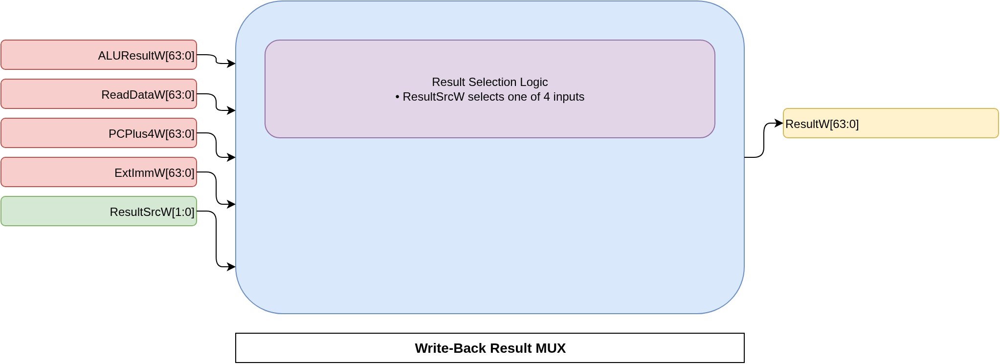

**Purpose**

* Selects the **final value to be written back** to the register file
* Completes instruction execution by committing results
* Supports multiple instruction result sources

**Module Role**

* Operates in the Write-Back (WB) stage
* Acts as the final data selection point before register update
* Controlled entirely by decode-generated control signals

**Inputs**

* `ALUResultW`

  * Result from arithmetic or logical ALU operations
* `ReadDataW`

  * Data loaded from data memory
* `PCPlus4W`

  * Sequential PC value used by jump instructions
* `ExtImmW`

  * Immediate value for immediate-based instructions
* `ResultSrcW`

  * Control signal selecting the write-back source

**Output**

* `ResultW`

  * Final value written into the register file

**Result Source Encoding**

* `ResultSrcW = 2'b00`

  * Write back ALU result
* `ResultSrcW = 2'b01`

  * Write back load data
* `ResultSrcW = 2'b10`

  * Write back `PC + 4` (JAL / JALR)
* `ResultSrcW = 2'b11`

  * Write back immediate value (LUI)

**Core Functionality**

* Implements a 4-to-1 combinational multiplexer
* Ensures only one result source is selected per instruction
* No internal state or clock dependency

**Design Characteristics**

* Simple combinational logic
* Clean separation between computation and architectural state update
* Deterministic and timing-friendly

**Pipeline Interaction**

* Feeds the register file write data port
* Controlled by MEM/WB pipeline register outputs
* Final stage in the instruction execution flow

## `datapath.sv` — Five-Stage Pipelined Processor Datapath

  

**Purpose**

* Implements the **complete processor datapath**
* Connects all pipeline stages from fetch to write-back
* Acts as the structural backbone of the CPU

**Pipeline Stages Covered**

* Instruction Fetch (IF)
* Instruction Decode (ID)
* Execute (EX)
* Memory Access (MEM)
* Write-Back (WB)

**Module Role**

* Integrates all functional units and pipeline registers
* Routes control signals generated by the controller
* Interfaces directly with the hazard unit
* Manages PC update, forwarding, stalling, and flushing

**Key Submodules Instantiated**

* Program counter and PC selection logic
* Instruction memory and instruction field extraction
* Register file and immediate generator
* ALU and branch comparison logic
* Data memory
* Pipeline registers (`reglayer_one` to `reglayer_four`)
* Write-back result multiplexer

**Control Signal Integration**

* Accepts decode-stage control inputs:

  * `RegWriteD`, `MemWriteD`, `ALUSrcD`
  * `BranchD`, `JumpD`, `ResultSrcD`
* Propagates control signals through pipeline stages
* Ensures correct timing via pipeline registers

**Hazard and Forwarding Support**

* Uses externally generated:

  * Stall signals (`StallF`, `StallD`)
  * Flush signals (`FlushD`, `FlushE`)
  * Forwarding selects (`ForwardAE`, `ForwardBE`)
* Supports:

  * Load-use hazard stalling
  * Data forwarding from MEM and WB stages
  * Control hazard flushing on branch/jump

**Program Counter Control**

* Computes `PC + 4`, branch targets, and jump targets
* Selects next PC based on:

  * Sequential execution
  * Taken branch
  * Direct jump (JAL)
  * Indirect jump (JALR)
* Stabilizes PC selection through a pipeline register

**Execution Flow**

* Register operands read in decode stage
* Forwarding applied before ALU execution
* ALU performs arithmetic, logic, branch, and Zba operations
* Memory accessed in MEM stage
* Final result selected and written back in WB stage

**Zba Extension Support**

* Shift-and-add operations executed in ALU
* Fully integrated into execute and write-back flow
* No special pipeline handling required

**Design Characteristics**

* Clean modular decomposition
* Clear separation of data and control paths
* Fully synchronous pipeline with combinational datapath logic
* Designed for clarity, correctness, and extensibility

**External Visibility**

* Exposes:

  * Register destination indices per stage
  * Opcode and function fields
  * Register write-back enables
* Enables tight integration with hazard and control units

## `WD3_mux.sv` — Decode-Stage Write-Back Data Selector

  

**Purpose**

* Selects the value forwarded toward the register file write-back path
* Used specifically to support control-flow instructions that write `PC + 4`
* Operates in the decode stage to simplify downstream control

**Module Role**

* Acts as an early write-back data selector
* Supports jump and link–style instructions
* Reduces complexity in later pipeline stages

**Inputs**

* `PCPlus4D`

  * Sequential program counter value from decode stage
  * Used for JAL / JALR link register updates
* `ResultW`

  * Execution or memory result value
* `WD3_SrcD`

  * Control signal selecting write-back source

**Output**

* `OUTWD3`

  * Selected data forwarded toward register write-back

**Selection Behavior**

* `WD3_SrcD = 0`

  * Selects execution result (`ResultW`)
* `WD3_SrcD = 1`

  * Selects sequential PC value (`PCPlus4D`)

**Supported Instruction Types**

* Arithmetic and logic instructions
* Load instructions
* Jump-and-link instructions requiring return address storage

**Design Characteristics**

* Purely combinational logic
* No internal state
* Minimal latency and area

**Pipeline Interaction**

* Used before final write-back selection
* Complements the main `result_mux` in the WB stage
* Helps maintain clean separation between control-flow and data-flow logic

**Design Rationale**

* Early selection avoids unnecessary pipeline complexity
* Keeps PC-based write-back handling explicit and readable
* Improves modular clarity in the datapath

## `tb.sv` — Self-Checking SystemVerilog Testbench

  

**Purpose**

* Verifies correct end-to-end functionality of the RV64I + Zba processor core
* Exercises arithmetic, Zba instructions, memory access, and control flow
* Automatically validates architectural state after program execution

**Module Role**

* Acts as the **top-level verification environment**
* Drives clock and reset
* Instantiates the processor core (DUT)
* Observes internal signals for correctness

**Clock and Reset Handling**

* Free-running clock with fixed period
* Deterministic reset sequence at simulation start
* Ensures pipeline and architectural state are initialized

**Instruction Execution Setup**

* Relies on preloaded instruction memory
* Confirms instruction memory initialization before execution
* Allows program to run for a bounded number of cycles

**Data Memory Monitoring**

* Observes store operations in the MEM stage
* Prints:

  * Simulation time
  * Memory address (word-aligned)
  * Data being written
* Aids in debugging memory-side effects

**Self-Checking Mechanism**

* Uses explicit register checks after execution
* Compares expected vs actual register contents
* Terminates simulation immediately on mismatch
* Prints pass/fail status for each checked register

**Assertions and Validation**

* Validates:

  * Immediate arithmetic (`addi`)
  * Zba operations (`sh1add`, `sh2add`, `sh3add`, `add.uw`)
  * Memory interaction effects
  * Control-flow correctness
* Ensures architectural state matches expected behavior

**Internal Visibility**

* Directly accesses internal register file for verification
* Acceptable for simulation and academic verification
* Avoids need for external debug interfaces

**Simulation Control**

* Bounded execution using cycle count limit
* Clean simulation termination on:

  * Successful completion
  * Assertion failure

**Design Characteristics**

* Deterministic and repeatable
* Fully self-checking
* Minimal external dependencies
* Suitable for regression testing

